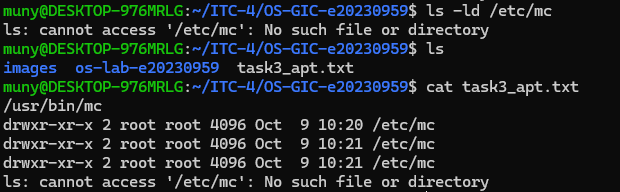
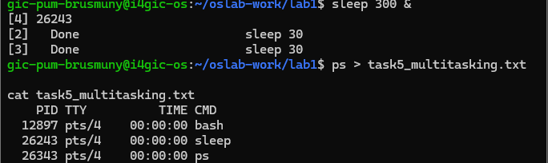
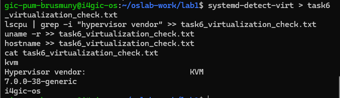

# OS Lab 1 Submission

Copy this template to `os-lab-YOUR_ID/lab1/README.md` in your own repository. Follow [the instructions](lab1-instruction.md). Your prediction and checkpoint answers are already saved by `oslab`; do not copy them here.

- **Student Name: PUM BRUSMUNY**
- **Student ID: e20230959**
- **Ubuntu username on the server: gic-pum-brusmuny**
- **My values** (`oslab values lab1`): file1 = silver, file2 = stone , count = 3

---

## Task 1: Operating System Identification

Briefly describe what you observed about your OS and kernel. Which number is the kernel version, and which is the distribution version?

The system is running Ubuntu 26.04.1 LTS, with the codename `resolute`, on an
`x86_64` machine. The kernel version is `7.0.0-38-generic` (shown by
`uname -a`). The distribution version is `26.04`, and the full distribution
description is Ubuntu 26.04.1 LTS.

```text
Linux i4gic-os 7.0.0-38-generic #38-Ubuntu SMP PREEMPT_DYNAMIC Fri Sep  4 09:10:14 UTC 2026 x86_64 GNU/Linux
Distributor ID: Ubuntu
Description: Ubuntu 26.04.1 LTS
Release: 26.04
Codename: resolute
```

---

## Task 2: Essential Linux File and Directory Commands

Briefly describe your experience creating, copying, renaming and deleting files. What did the last `ls` show?

I created `silver.txt` and `stone.txt`, copied `stone.txt` to
`stone_copy.txt`, and renamed the copy to `stone_renamed.txt`. I also copied
`silver.txt` to `silver_copy.txt` and then deleted the copied files as
required. The final `ls` showed:

```text
silver.txt
stone_renamed.txt
```

This confirmed that the original file and the renamed file remained after the
copying and deletion commands.

---

## Task 3: Package Management Using APT

Explain the difference you observed between `remove` and `purge`.

`apt-get remove mc` uninstalled the Midnight Commander program
(`/usr/bin/mc`) but left its configuration directory `/etc/mc` in place.
`apt-get purge mc` removed the package and its configuration files; afterward,
`ls -ld /etc/mc` reported that the path did not exist. Therefore, `remove`
keeps package configuration files, while `purge` removes them as well.

<!-- SCREENSHOT REQUIREMENT: your terminal after the purge, showing `ls -ld /etc/mc` and your prompt. -->


---

## Task 4: Programs vs Processes

Briefly describe how you ran a background process and found it in the process list. What is the difference between a program and a process? What did you see before, during and after?

I started `sleep` as a background job by adding `&` to the command. While it
was running, `ps` showed a `sleep` process together with the shell and the
`ps` command itself. After the sleep duration ended, the `sleep` process was
no longer present. A program is the stored executable code, whereas a process
is a running instance of that program with its own process ID, state and
resources.

---

## Task 5: Multitasking

Briefly describe the multitasking you saw. How many `sleep` lines did `ps` show? What does that show about the system, and what does it **not** show about how the processor is shared?

The `ps` output showed **three** `sleep` lines, each with a different process
ID. This shows that the system can keep multiple processes active at the same
time. However, the output does not show how the processor is shared between
them: it does not indicate whether they ran simultaneously on different CPU
cores or were rapidly scheduled one after another on a single core.

<!-- SCREENSHOT REQUIREMENT: your terminal with the `ps` result and your prompt. -->


---

## Task 6: Virtualization and Hypervisor Detection

State whether your system is running on a virtual machine or physical hardware, based on the command outputs.

The system is running on a **virtual machine**. The virtualization checks
reported `kvm` and identified the hypervisor vendor as `KVM`, which indicates
that the operating system is hosted by a KVM hypervisor rather than running
directly on physical hardware.

<!-- SCREENSHOT REQUIREMENT: your terminal with the output of the four commands and your prompt. -->


---

## My Prediction: Confirmed or Corrected

For each prediction answer (`oslab predict lab1`), write **confirmed** or **corrected** and what you saw that shows it. You test the third answer (`apt-get remove`) in Task 3.

1. **Confirmed.** The OS information matched the prediction: the kernel was
   `7.0.0-38-generic`, while the Ubuntu distribution release was `26.04`
   (Ubuntu 26.04.1 LTS).
2. **Confirmed.** The file-command results showed that files could be created,
   copied, renamed and deleted, and the final directory listing contained
   `silver.txt` and `stone_renamed.txt`.
3. **Confirmed.** The prediction about `apt-get remove` was supported by the
   result: the `mc` executable was removed, but `/etc/mc` remained until
   `apt-get purge mc` was run. After the purge, `ls -ld /etc/mc` reported
   "No such file or directory."
---

## Plus / Challenge (only if you did them)

No additional challenge was completed.

## AI Note (optional)

An AI tool suggested explaining the difference between a program and a
process using the `sleep` command. I checked this against the `ps` output by
comparing the executable name (`sleep`) with the individual process IDs shown
while the command was running.
